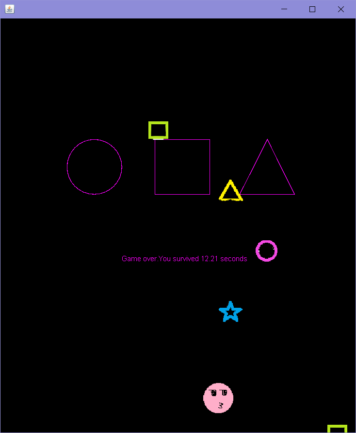

# Dodging game: Squid game
 The idea comes from popular a survival film - Squid Game. Players need to dodge the obstacles shaping in rectangle, triangle, circle,... and falling down. 
The score will be the time you "live" in second. 

Advice from the author: Think of it as a simple game until it's out.



## Coding explanation 
There a 5 class. 
* Player 
* Obstacle
* Playground 
* TriangleShape
* Main


### Player 

Class `Player` has these properties:
```java
public class Player {
    private Rectangle shape;
    private int width = 40;
    private int height = 35;
    private int move;
```
I decide base-shape of player is rectangle with 40 (px) of width and 35 of height. 
Key methods of `Player` class:
```java
 public void moveLeft(){
        if(shape.x-move < 10){
            System.out.println("\b");
        }else{
            shape.x -= move;
        }
    }
    public void moveRight(){
        if(shape.x+move>600-90){
            System.out.println("\b");
        }else{
            shape.x += move;
        }
    }
```
It is very simple and allow player to move right or left in horizontal with keyboard. 
### Obstacle
The class is more complex than `Player` class. So I decided what I need before I start. 
* A lot of Obstacles -> `ArrayList<Rectangle> listOfObstacles`
* Falling down randomly -> `Random rand = new Random();`
* A method to combine the above two factors -> `public void addObstacles(boolean first)`


###PlayGround
PlayGround and interface will be desiged in this class 
### Video demo
<a href="http://www.youtube.com/watch?feature=player_embedded&v=W4cvH6HLetU
" target="_blank"></a>
